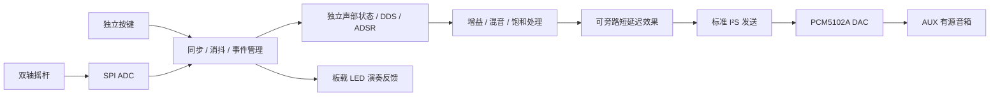

# 2026 高云电子乐器：设计与采购建议

更新日期：2026-09-26。状态：方案草案，尚未实现或测量；用户已确认报名选题二。本阶段不操作板卡。

## 依据与边界

[高云 2026 官方赛题](https://www.gowinsemi.com.cn/university/match2026)的关键约束：≥2 独立交互维度，HDL 逐样本合成，≥4 复音，变调、ADSR、混音、I²S 输出，端到端延迟≤10 ms，不能播放预录音频。拓展方向包括≥32 复音、≥3 维表情、≥2 音色、效果器和≤5 ms 延迟。评测关注活跃独立振荡器数×实际采样率，并要求频谱及 RTL 证据。官网作品截止为 11 月 4 日 18:00。

板卡资格已通过用户提供的 2026 选题指南补充核对：PDF 第 13 页（印刷页码 11）“自备开发板”明确允许以高云 FPGA 为核心的第三方开发板。Primer 20K 使用高云 GW2A，符合这项平台条件，无需仅因未出现在推荐名单而更换。该结论不代表各项功能已达标。来源身份、页码和 SHA256 见 [资料核对记录](reference-review-2026.md)。

## 已有硬件

- Tang Primer 20K + Dock：SRAM 点灯已由用户确认；后续沿用 USB 直连、JTAG 请求 100 kHz。
- 用户有 DS100 MINI 示波器、面包板，可借万用表；耳机及音箱尚无，杜邦线数量未确认。
- 板卡照片左侧最下方按键标为 RCFG，用户曾误称它为“S4”；不要拿来演奏。2026-09-29 已用 SSPI 作为普通 IO 使 S0/T10 发声，用户确认 S0–S3 四键都能发声；仍需把当前单音合成改成四复音。详见[按键核对记录](button-audio-next.md)。[Sipeed 引脚约束](https://github.com/sipeed/TangPrimer-20K-example/blob/main/Litex/sipeed_tang_primer_20k/src/sipeed_tang_primer_20k.cst)
- Dock 板载音频 DAC 为 PT8211-S。[Sipeed 官方示例](https://github.com/sipeed/TangPrimer-20K-example)
- PT8211 的串行接口是 LSBJ/Japanese 格式，不能只因有 BCK/WS/DIN 就称为标准 I²S。它适合先验证发声；最终建议另用标准 I²S DAC，以贴合题目措辞。[PT8211 原厂数据手册（PJRC 托管）](https://www.pjrc.com/store/pt8211.pdf)

## 建议作品：8 键双轴表情电子琴

演奏操作：8 个独立按键选择音符并支持和弦；摇杆 X 控制连续弯音，Y 控制音色亮度或颤音深度。板载按键用于八度、音色和测试模式。先做两种可区分的合成音色，例如柔和正弦/谐波音色和明亮拨弦音色，再加一项短延迟效果。

摇杆 X、Y 是两个独立模拟输入，映射到不同的连续声音参数。与选音合用形成明确的多维演奏控制；具体评审解释仍以赛方为准。[DFRobot 摇杆参考规格](https://wiki.dfrobot.com/dfr0061/)

FPGA 负责事件处理到音频样本输出的全部计算；ADC 只采集动作、DAC 只转换声音。电脑只用于开发和测试，不生成或推送演奏音频。

### 合成引擎

- 第一版 4 声部，最终目标 32 声部，每声部独立相位、频率、包络及分配状态。
- 8 个实体键不等于人手能同时按出 32 个不同音。演奏模式通过八度切换、延音和重触发保留独立声部；专门测试模式一次启用 32 个不同频率声部验证并发能力，演奏能力与引擎容量分别报告。
- 采用 DDS 配合数学生成的单周期波表，支持连续变调。单周期振荡器波表不是整段录音，但演示和 RTL 要能证明实时相位推进及包络运算。
- 先实现两种带限波表或受控谐波音色，避免直接把未带限锯齿波当作高质量音色。
- 32 声部拟采用 4 条硬件流水线，每条按固定时隙更新 8 个声部；各声部状态独立。是否满足性能和评审统计要求，需通过综合、时序与频谱验证，不用模块名字推算得分。
- 16 位有效采样先跑通，内部混音扩展位宽并做增益归一化、饱和保护，最后再评估 24 位输出收益。
- 自动演示只存音符、时值和控制事件，仍由同一合成引擎生成声音。
- DDR3、蓝牙和手机 App 不列入首版，优先把音频通路、复音和演奏体验做好。

### 时钟与延迟

- 实际采样率目标 48 kHz。不能把 27 MHz 粗略分频的结果直接写成 48 kHz。
- 优先验证现有 FPGA 时钟资源能否产生合适音频时钟。若不能满足准确度目标，用 12.288 MHz、3.3 V LVCMOS 的已焊接有源时钟模块接入合适的 FPGA 时钟引脚：除以 4 得到 3.072 MHz BCLK，除以 256 得到 48 kHz LRCK（每声道 32 位时隙）。引脚及电压核对后才能接线。
- 控制与音频若跨时钟域，用同步、握手或异步 FIFO 传递完整事件，不能只对多位频率字逐位同步。
- 摇杆每轴目标 2 k 次/秒采样；SPI ADC 留充足余量。按键采用低延迟首沿识别配合防重复触发，释放另行消抖，不统一加 20 ms 等待。
- 延迟工程目标≤5 ms，基础验收上限按赛题；必须包含输入检测、滤波、调度及 DAC 数字滤波的实际延迟。ADSR 测试模式使用短 Attack，并说明判定音频起点的阈值。

## 采购顺序与规格

以下金额是通用模块的预算预留，并非已核价的店铺报价，也不是采购订单。不同卖家的供电、跳线和排针有差异，购买前核对具体商品图与原理图。用户主要负责接线，优先选排针已焊接的模块。

| 批次 | 物品与数量 | 选购要求 / 用途 | 预算预留（元） |
|---|---|---|---:|
| 第一批 | PCM5102A DAC 模块 ×1 | 标准 I²S，BCK/LRCK/DIN 引出，3.3 V 数字接口，带线路输出；优先 3.5 mm 接口、已焊排针。FMT、XSMT、SCK 等跳线有说明 | 15–40 |
| 第一批 | MCP3008 SPI ADC 模块 ×1 | 已焊接，能按 3.3 V 供电及参考电压工作，读取摇杆两个模拟量；不用单独购买裸贴片芯片 | 15–40 |
| 第一批 | 双轴模拟摇杆模块 ×1 | X/Y 两路模拟输出，3.3 V 供电，已焊排针；例：PS2 型电位器摇杆，DFRobot DFR0061 为规格参考 | 5–40 |
| 第一批 | 有源小音箱 ×1 | 必须有 AUX/3.5 mm 模拟输入及音量旋钮；供电独立处理，USB 可只供电；不用蓝牙链路作为低延迟验收输出 | 40–100 |
| 第一批 | AUX 线 ×1、杜邦线若干 | 与 DAC/音箱插口匹配；补齐母母、母公、公公，按现有余量购买 | 15–30 |
| 第二批 | 8 键独立按键板 ×1，或按键模块 ×8 | 每键独立数字输出、3.3 V 兼容；能同时识别至少 4 键。不要单 ADC 电阻键盘；无二极管矩阵板不能直接保证无冲突 | 15–40 |
| 条件采购 | 12.288 MHz 有源时钟模块 ×1 | 已焊接、3.3 V LVCMOS，有清晰使能及供电说明；先验证 PLL 方案再决定 | 10–30 |
| 后期 | 面板、固定柱和连接件 | 等演奏键布局验证后再定尺寸 | 20–50 |

第一批按通用模块预留约 150–250 元；加键盘、时钟和面板，整体先按约 300–400 元封顶规划，最终看商品兼容性与实价调整。没有必要现在同时买耳机和音箱，也无需新买 FPGA、示波器、STM32 或树莓派。

PCM5102A 支持三线 I²S，输出为线路级；普通无源耳机/裸扬声器不直接挂在其输出上。采用有源音箱可省掉单独的耳放/功放开发。[TI 产品资料](https://www.ti.com/product/PCM5102A)

MCP3008 为 8 通道 10 位 SPI ADC，速度随供电和时钟条件变化；本项目只需低得多的控制采样率，不把 5 V 下的最高指标套用到 3.3 V。[Microchip 资料](https://www.microchip.com/en-us/product/MCP3008)

供电与接线：模块数字输出不得超过所接 FPGA IO bank 电压；ADC 输入及参考电压保持规定范围；音箱不从 FPGA GPIO 取电。具体引脚表在实际模块确认后对照 Dock 原理图生成，不按其他 Tang 板照搬。

## 分阶段验收

| 时间目标 | 交付内容 | 可检查的证据 |
|---|---|---|
| 9/27–10/2 | DAC 单音；板载按键 4 复音 | 引脚表、采样时钟与模拟波形、四音同时发声；HDL 仿真 |
| 10/3–10/9 | 摇杆两个表情轴、ADSR、两音色 | 两个控制量可独立改变声音；输入到模拟输出延迟测量 |
| 10/10–10/18 | 32 声部、饱和处理、验证模式 | 32 个独立状态；实际采样率；独立谱峰；资源和时序报告 |
| 10/19–10/25 | 8 键面板、LED 反馈、短延迟效果 | 演奏视频、干湿对比、持续演奏无爆音/丢音 |
| 10/26–11/1 | 固化版本与参赛材料 | 功能矩阵、RTL、测试数据、接线图和演示视频 |
| 11/2–11/4 | 留作修复及提交缓冲 | 按报名系统实际要求核对文件与提交回执 |

用户的 DS100 MINI 优先用于：BCLK/LRCK、音频波形、双通道输入事件与音频起点测量。多谱峰证据用可导出的采样做 FFT，或借带线路输入的声卡录制 DAC 输出再分析；先核对现有示波器的数据导出能力，不急于买声卡。电脑分析录音是测量，不替代 FPGA 发声。

测试模式应支持 4/8/16/32 个不同频率正弦声部，所有声部真正同时进入 DAC。使用与 FFT 窗口相容的频率、足够采样长度及安全总增益，避免谱泄漏、限幅和谐波冒充独立声部。正式性能数字在实测后填写。

## 当前下一步

先完成软件侧的 I²S / DDS / ADSR 仿真和引脚核对，同时选具体模块。配件到货后，从单音和板载 4 键开始。Primer 20K 自备平台条件已核实。当前只做设计，不因本方案自动扩大原有烧录授权范围。
